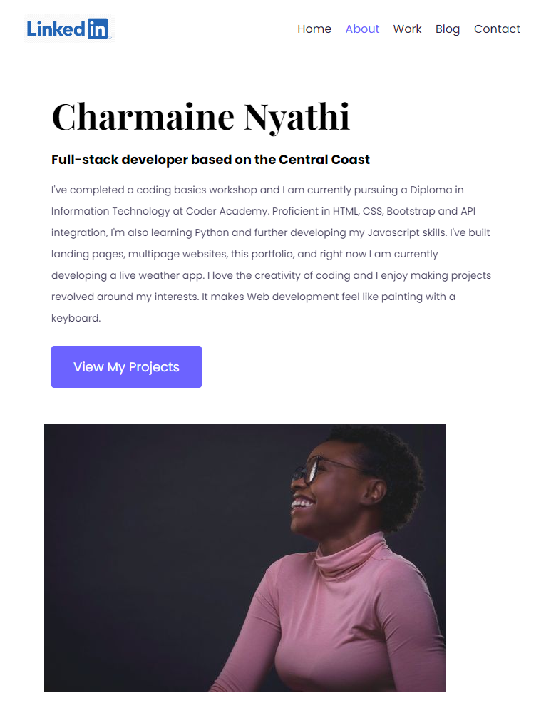
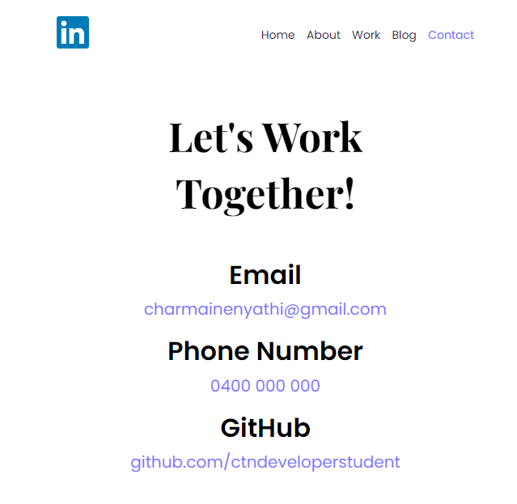

# CharmaineNyathi_T1A2 Portfolio
Published portfolio: https://charmainenyathi.netlify.app/

Github repository: https://github.com/ctndeveloperstudent/portfolio-may

## Description
### Purpose
This portfolio serves to showcase my strengths, talent, abilities and coding experience to prospective employers. It presents me as a developer and an IT professional. It includes my details, my work, my skills, interests and also includes links to my other professional accounts such as linkedin and github, to further demonstrate my work and abilities as an IT professional. 

### Target audience 
The target for this portfolio is an employer with technical knowledge relating to IT, programming languages, software development with high expectations of a professional and positive work ethic looking to hire a web developer.

### Functionality, Tech Stack & Features
The portfolio is built with HTML, CSS and Bootstrap. All images used are royalty free. All text is written by me or is Lorem Ipsum placeholder text.

## Contents

### Site Map & Overview of Portfolio
This portfolio begins with the homehero page that introduces me, displays a preview of my work (with the option to learn more) and has the options to contact me or download a pdf of my resume and cover letter. It then leads to the about page which gives a description of who I am, where I've been and what I do, with an image of me so the prospective employer can see what I look like. Under the description there’s a call to action to view my projects, which leads to the Work page. This page contains my projects and the option to launch them. 

The next page is the blog page, with a preview of the posts and an option to view more. Finally the contact page, where the employer can learn more via Github and Linkedin or they can contact me directly via phone or email.

### Wireframe & Overall Aesthetic of the Website
The aesthetic for my portfolio is clean with a hint of cohesive colour. I chose a minimalistic design of a white background with black text with a decreased opacity so the intensity is minimised and is therefore pleasing to the eyes to read. I chose purple to give my portfolio a pop of colour because it combines the fierceness of red with the calm stability of blue. I then chose a variety of shades to maintain the cohesive design while being interesting from a design perspective.

I used CSS grids and flex box to produce a layout that would suit any device: phone, tablet or desktop. To demonstrate my understanding, I chose to shift the images on each layout depending on what you were using to view my portfolio. For example if you were viewing the homepage using a desktop, you will see every element including the images and the project display would be split into two columns. However if you were viewing it from a tablet or a mobile phone, i chose to hide the images and align the text in the middle for a more seamless experience.

My design for a mobile phone and a tablet are identical so in-order not to repeat myself twice unnecessarily, I chose to use one media query with a max width of 900px and it works great on every device.

Desktop Wireframe

Tablet and Mobile Wireframe

### Homepage: 
Includes the nav bar, hero page to introduce me, including an option to contact me or to download and view my resume and cover letter, brief display of my projects with incentive to learn more and a footer with links to contact me and direction to my professional accounts (LinkedIn and Github) as well as my email address. There’s also a line to showcase my github and the fact that my portfolio is open sourced.

Homepage Desktop Screenshot

Homepage Mobile and Tablet Screenshot

### About Me: 
Includes my name and my job description followed up by an image and a paragraph about me. The paragraph includes information about me, education, skills, coding languages, my interests and why i’l learning to code.

Desktop About Me Screenshot

Mobile/Tablet About Me Screenshot

### Work: 
The work page includes a preview of all my projects, their title and information about what coding languages were used to build them. These projects are built around my interests, my favourite movie, my favourite band and my favourite hobby. There’s also a launch project button that leads the viewer to experience the project for themselves.

Desktop Work Page Screenshot

Mobile/Tablet Page Screenshot

### Contact Page
Includes clean and simple calls to actions with my contact details and social links which are all clickable.

Desktop Contact Screenshot

Mobile Contact Screenshot

## HTML Components
1. Header: Used to navigate the website and give user an overview of the website. Styling is simple, classic and easy to use.
2. Intro section: Introduces me to the user and allows them to contact me and download my resume and cover letter. Styling is clear and clean to grab the user's attention.
3. Learn more button: Allows the user to go from project preview on the home page, directly to work page so they can launch the project. Styled using the branding colour and has a 100ms transition applied for smooth use.
4. Contact section: Gives a minimal view of my social platforms and allows the user to click and access them. Styled using icons and light colour to draw attention to the area and seperate it from the rest of the page.

## Graphic Components
1. Social Icons: Use icon images for an uncluttered look and ease of use for the user. All icons are links that open to a different tab so the user can explore my other social pages without leaving the portfolio.
2. Image: Image is styled so it has a different size and look depending on the device used to view it, Image is not too big compared to the text and will not overwhelm anyone whole scrolls past or looks at it.
3. Image: Image is styled so it has a different size and look depending on the device used to view it, Image is not too big compared to the text and will not overwhelm anyone whole scrolls past or looks at it.
4. Image: Image is styled so it has a different size and look depending on the device used to view it, Image is not too big compared to the text and will not overwhelm anyone whole scrolls past or looks at it.
